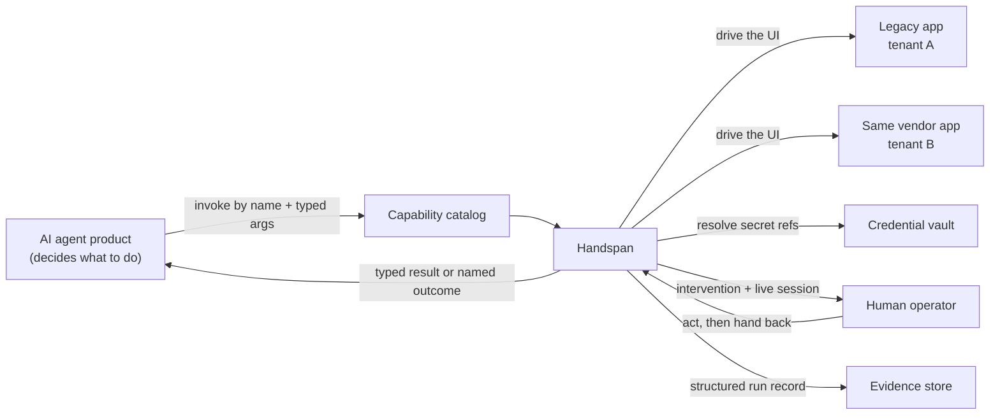
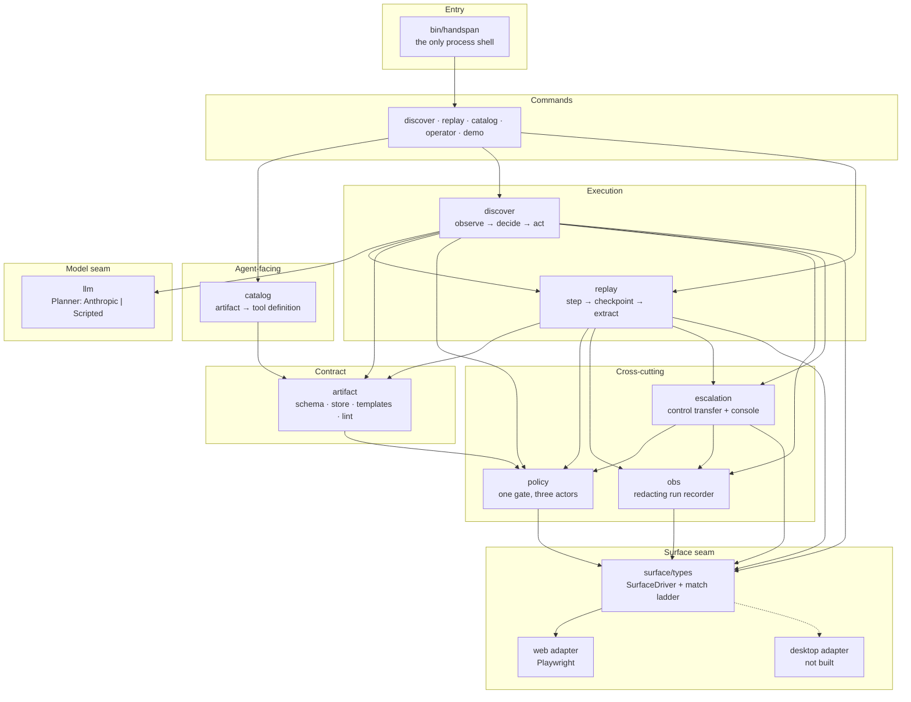
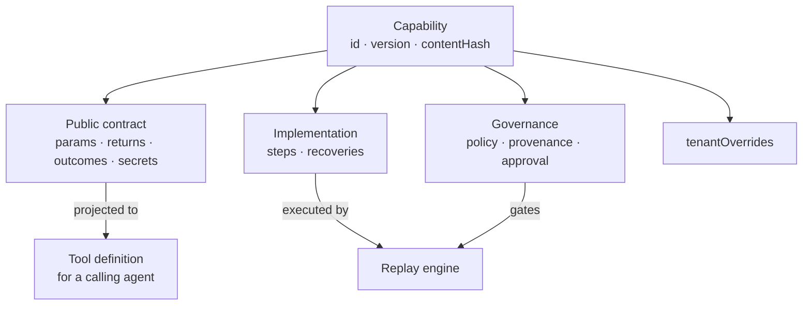
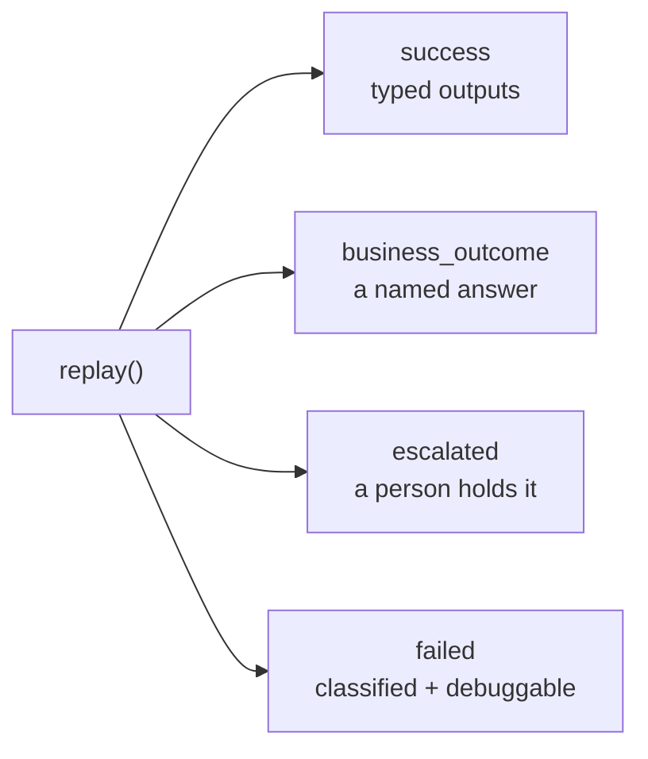
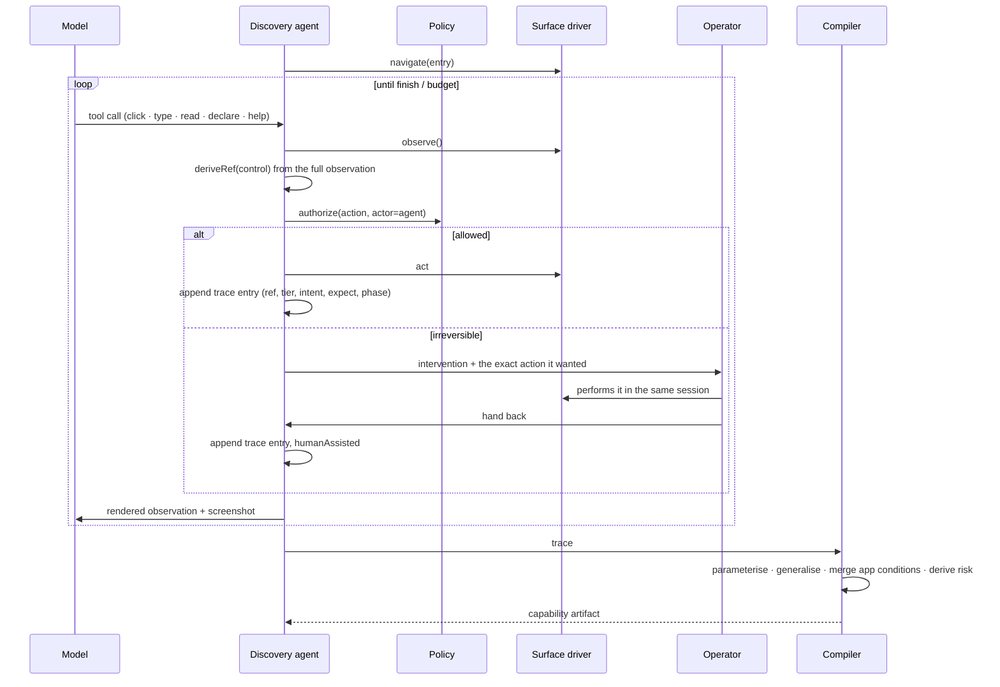
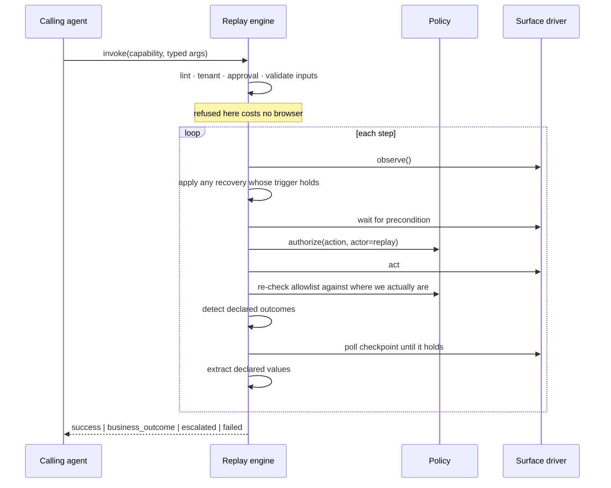
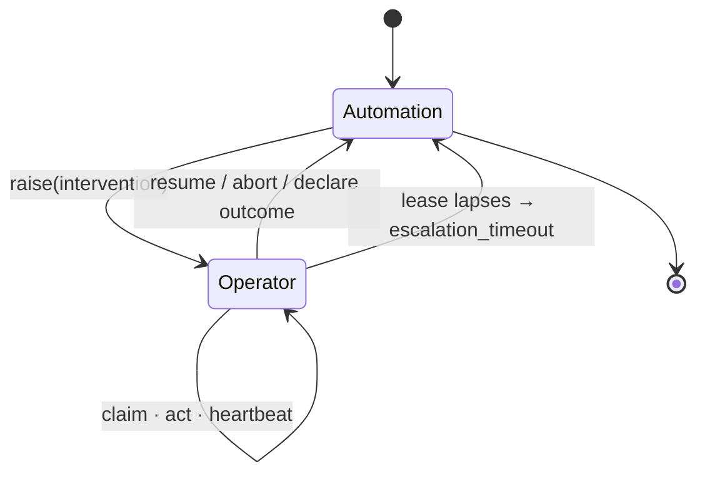
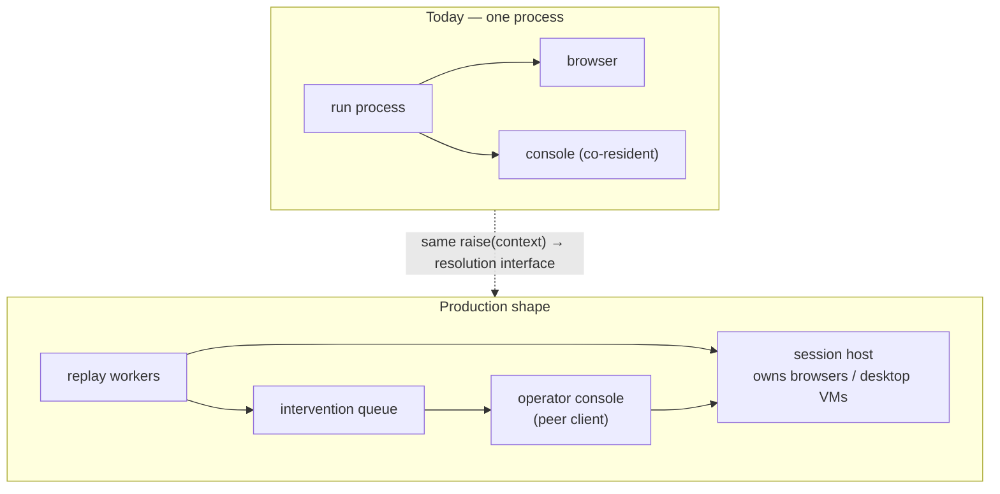

# Handspan — High-Level Design

**Audience.** An engineer or architect evaluating the system's shape, boundaries
and decisions without reading the code. The companion [LLD](LLD.md) specifies
the interfaces, algorithms and invariants.

---

## 1. Problem

Banks and credit unions run a long tail of back-office applications with no API:
core banking screens, servicing tools, admin consoles. The only way in is to
drive the UI the way an operator would. An AI agent product needs those systems
to *do things* — look up a member, open a sub-account, post an adjustment — and
needs it to be cheap, repeatable, auditable and safe.

Using an LLM for every invocation fails on all four counts: it costs per call,
it is non-deterministic, it leaves a transcript rather than an audit trail, and
it puts a probabilistic system in front of an irreversible posting.

**Handspan splits the problem in two.** A model is used *once*, to discover how
a task is done. That run is compiled into a typed, versioned, reviewable
**capability artifact**. Every subsequent invocation replays the artifact
deterministically, with no model in the decision loop.

> The model discovers. The artifact is the capability. Deterministic replay is
> how an agent invokes it.

### Environment constraints that shape everything

| Constraint | Consequence for the design |
|---|---|
| UIs are stable but runtime errors are common | Optimise for a record-once model, but make runtime conditions first-class: validation errors, not-found, permission denials, unexpected dialogs, session expiry, slowness, app aborts |
| Surfaces are heterogeneous: modern web, legacy web, native desktop | The targeting vocabulary must be expressible on all three. No CSS, no coordinates, above the adapter |
| Hundreds of tenants × ~20 apps, many sharing a vendor product | One artifact per flow with per-tenant specialisation, not one per tenant |
| Regulated financial data | Declared sensitivity, vault-referenced credentials, redaction on the way out, nothing valuable in an artifact |

## 2. Goals and non-goals

**Goals.** A working vertical slice: goal → LLM run → artifact → deterministic
replay with typed inputs/outputs and a real error taxonomy → human escalation
that can take over the live session → evidence for everything. Abstractions that
would extend to desktop surfaces and to a multi-tenant estate.

**Non-goals.** Queues, clusters, tenant registries, a production operator
console, a desktop adapter. Building scaling infrastructure before the core
abstractions are right is the failure mode this design avoids.

## 3. System context

Handspan is the *hands*. The agent product upstream decides what to do; Handspan
is how it reliably and safely does it inside software that offers no other way
in.

## 4. Component architecture

Dependencies point one way, with a single cycle: `artifact` imports the redactor
from `policy` at runtime, and `policy` imports two *types* back from `artifact`.
The back edge is type-only and vanishes at compile time.

| Module | Responsibility |
|---|---|
| `surface` | The hard seam. Named-control vocabulary, the resolution ladder, the driver interface |
| `surface/web` | Playwright adapter and the in-page perception pass |
| `artifact` | Capability schema, persistence and integrity, the linter, tenant specialisation, app profiles |
| `discover` | The LLM loop, the observation renderer, the trace, and the trace→artifact compiler |
| `replay` | The deterministic executor, the condition evaluator, the result contract |
| `policy` | The guardrail every action passes through; redaction primitives |
| `escalation` | Control transfer, the intervention lifecycle, the operator console |
| `obs` | The redacting run recorder and evidence capture |
| `catalog` | Projection of an artifact into an agent-callable tool definition |
| `llm` | The planner seam |
| `cli` | Command functions; `bin/` holds the only `process.argv` read |

## 5. The two seams

Everything that makes this extensible is one of two interfaces.

### 5.1 `SurfaceDriver` — the hard seam

Above it, the system speaks only of **named controls**: a role from a closed
vocabulary, an accessible name, and a scope. Below it, an adapter may do whatever
its platform requires. An adapter owes three things: `observe()` to flatten what
it can see into named controls, `resolve(ref)` to turn a durable reference back
into a live control *and report how confidently it did so*, and the act/read
methods.

Two implementations exist today — Playwright, and an in-memory driver the replay
tests drive in ~130 lines. That a fake can implement it that cheaply is the
evidence the seam is real.

**The model is never given coordinates.** It receives a screenshot for
perception and a list of handles for action. A coordinate is not a durable
locator, so an agent that clicks coordinates produces nothing replayable; a
coordinate is also not expressible in a desktop adapter. Constraining the action
space to identified controls is what makes a discovery run recordable at all.

### 5.2 `Planner` — the soft seam

Hand it tool results, get back tool calls. Two implementations: Anthropic, and a
scripted planner that replays a fixed call sequence. The scripted one is not a
toy — it drives the whole discovery pipeline offline and deterministically, which
is how discovery is tested and how the demo runs without a key.

## 6. Core data model

Two artefacts carry the whole contract.

### 6.1 The capability artifact

A typed, versioned YAML document with three readers, which is why it is shaped
the way it is:

- a **calling agent** needs a description, typed inputs, typed outputs, and the
  enumerated outcomes it might get back — and must never read the steps;
- the **replay engine** needs ordered steps where every target is durable and
  every step carries its own success condition;
- a **human reviewer** has to approve it for unattended execution against a
  production core, so reading it must be plausible in minutes.

Four properties are load-bearing:

1. **Contract and implementation are separated.** An agent binds to the former.
   The tool definition is a pure projection of it, so it cannot drift.
2. **Every step carries its own checkpoint.** The artifact is not "a list of
   clicks" but "a list of clicks and what each should have achieved" — which is
   what lets replay fail loudly at the right step instead of drifting to the
   wrong screen and returning a confident wrong answer.
3. **Nothing in the file is a value.** Inputs are `{{templates}}`, credentials
   are `{{secret:vault.key}}`. An artifact is safe to commit and safe to review.
4. **Approval is pinned to a content hash**, so editing a step revokes it.

### 6.2 The result contract

The three-way split at the top is the most important decision in the system.
Collapsing `business_outcome` into `failed` is not untidy, it is dangerous: a
calling agent that cannot distinguish "this member does not exist" from "the
automation is broken" will either retry forever or tell a member their account
is missing when the truth is that a control moved.

**Recoverable conditions are deliberately not a status.** A dismissed
interstitial or a re-authenticated session is an implementation detail of a
successful run. It appears in `recoveries` for observability and changes nothing
about what the caller does next.

## 7. Key flows

### 7.1 Discovery

The reference is derived **at the moment of the action**, while the full
observation is in hand — the only point at which the system knows what else was
on screen, and therefore what the minimum unambiguous reference is.

### 7.2 Replay

**Outcomes are checked before checkpoints.** When a search returns "no member
found", the checkpoint "the member detail screen is showing" is *also* false.
Whichever is evaluated first decides whether the caller learns a fact about the
member or a fact about the automation.

### 7.3 Escalation and control transfer

Three properties make a handoff safe:

- **One session, one controller.** A token held by exactly one actor. Any action
  from a non-controller throws. This is what stops the agent retrying a step
  while a person is mid-way through fixing it by hand.
- **One action pipeline, two actors.** The operator's clicks go through the same
  `authorize → act → record` path with `actor: 'operator'`. Every manual step
  lands in the same log in the same shape, and the origin allowlist still applies
  to a human. Authority differs; the boundary does not.
- **A lease, not a promise.** Heartbeat-extended; when it lapses, control returns
  and the run fails with a clear reason rather than hanging.

## 8. Cross-cutting concerns

### Safety

Layered, each layer assuming the one above can be wrong.

| Layer | Mechanism |
|---|---|
| Where | Origin + path allowlist, deny by default, checked on navigation *and after every action* because a click can go anywhere |
| What | Action-kind allowlist; per-action risk tier inferred from the control's label, tuned to over-classify |
| Who | Agent escalates irreversible work; replay's authority comes from the artifact's approval; operators may commit inside the same boundary |
| Secrets | The model never sees a credential — it names a vault key and the system types the value |
| Data | Declared sensitivity per parameter and return; pattern redaction as a backstop applied inside the recorder, not at call sites |

Risk is **per step**, not per capability, because these flows are a long
read-only prefix followed by one commit. Gating the whole capability on its worst
step would make every read require approval.

### Observability

One run directory per execution: an ordered JSONL event stream, the result
contract as returned, per-step screenshots, and frame snapshots on failure.
Redaction happens inside the recorder so a log statement added later cannot leak.

### Multi-tenancy

One shared artifact plus per-tenant specialisation: a label alias map applied to
every reference at once, surgical per-step patches, disabled steps, extra
recoveries. Application-level runtime conditions live in an **app profile**, once
per app, not once per capability — a discovery run can only meet the conditions
it happens to encounter, and "this app signs you out after fifteen minutes" is a
fact about the app that is true for all twenty of its capabilities.

## 9. Deployment view

The broker is an in-process interface today, which is why the console runs inside
the run that owns the browser. Production puts a session host behind that
interface and a durable queue in front of it. The shape of `raise()` — context
in, resolution out — and the control-transfer invariants it enforces do not
change.

## 10. Capacity reasoning

Numbers that drive the design rather than the implementation:

| Quantity | Order of magnitude | What it implies |
|---|---|---|
| Tenants | hundreds | Artifacts must be shared with overrides, not copied |
| Apps per tenant | ~20 | App-level conditions must live once per app |
| Capabilities per app | 10s | Recording cost must be amortised; re-recording per tenant is untenable |
| Replay cost | one browser session, seconds | Horizontally scalable, stateless per run |
| Discovery cost | one model run, minutes | Rare, human-supervised, not on the hot path |

## 11. Trade-offs

| Chose | Over | Because |
|---|---|---|
| Role + name + scope as the primary locator | CSS selectors | The only vocabulary expressible on a DOM, a 2003 frameset *and* a Win32 window read through UI Automation |
| A hand-written naming cascade | The browser's accessibility tree | The AX name is empty on exactly the surfaces this targets; the cascade is a superset with the same output shape |
| Human-declared public contract | Model-invented one | The interface an agent binds to has compliance consequences and is cheap for a person to write |
| Condition polling in the engine | Sleeps, or trusting the driver | A slow screen should cost latency, not a failed run |
| Stamping an attribute on elements to address them | CDP backend node ids | Robust across frames and cheap; it does mutate the page, which is a real cost |
| YAML artifacts | JSON | The artifact is the review unit, and nested conditions are legible in YAML |
| One in-process broker | A queue and session host | The seam is what matters at this stage; building the infrastructure first would have been premature |

## 12. Risks

| Risk | Mitigation | Residual |
|---|---|---|
| A wrong artifact does the wrong thing to the right app | Per-step checkpoints, risk tiering, hash-pinned approval | An approved artifact with a wrong step still executes |
| Risk classification misreads a label | Over-classification bias, per-app overrides, human approval for anything discovery escalated | A button labelled "OK" that posts a wire is classified read-only |
| Regulated data in evidence | Declared sensitivity, redaction in the recorder, masked screenshots | Sensitive data rendered as free text is still in the PNG |
| Vendor release moves a control | Tier-drift reporting per step, stability history on the artifact | Detection is per-run; there is no estate-wide monitor yet |
| Operator console is the most security-sensitive component | Same policy gate as the agent, lease-bounded control | No authentication; it is a localhost development surface |

## 13. Where to look next

- [LLD.md](LLD.md) — interfaces, algorithms, invariants, extension recipes.
- [../REPORT.md](../REPORT.md) — the decision write-up, including what was cut.
- [../evidence/INDEX.md](../evidence/INDEX.md) — worked runs of every path above.
